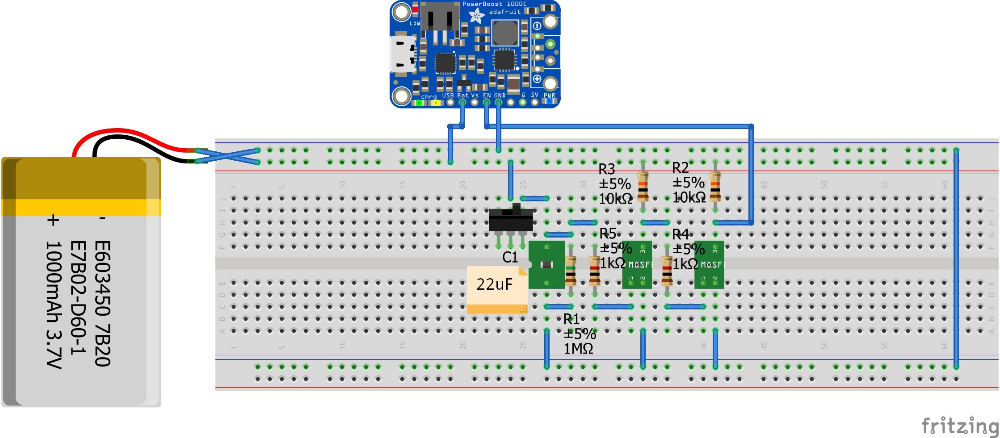
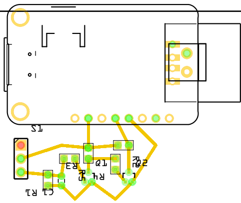
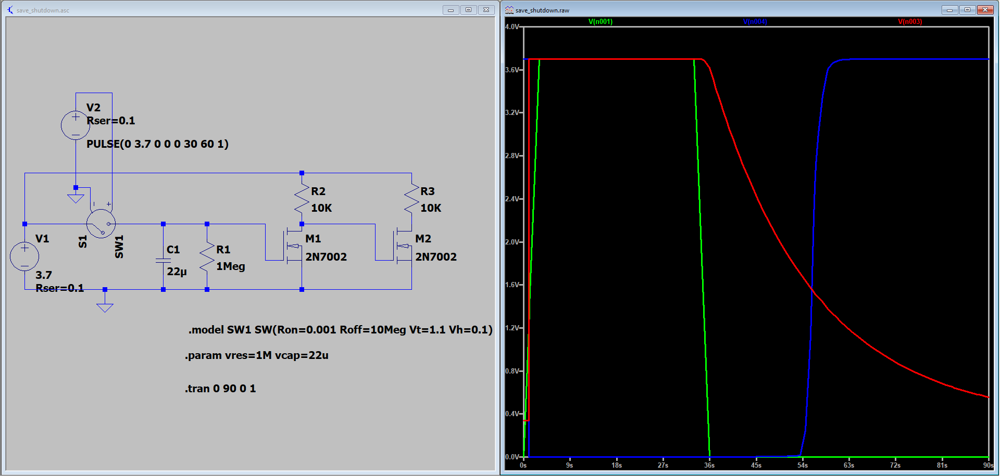

# Save Shutdown for Adafruit Power Boost 1000c

This project is a save shutdown for Adafruit Power Boost 1000c. You can use this circuit to have a delay in the power-off, after the user switched the device off. This can be usefull to detect that and execute a shutdown on e.g. your Raspberry Pi. The time depends on the RC-time-constant (current values 1MOhm, 22uF -> about 25s). You can try other values with the spice simulation in `simualtion/`, depending on your needs. Even though im an electrical engineer im not a master in circuit design, which means that there might be a better way to do this (potentially with less electrical components). If you have any suggestions create a pull request or open an issue.

## Usage

The circuit was created with Fritzing (https://fritzing.org/). Download and install it, to edit the files and generate gerber files. If you just use a breadboard, you will be fine with the following preview.

## Preview

 

 

 

## Dependencies

PowerBoost 1000C Fritzing Component:
* https://github.com/adafruit/Fritzing-Library
* It is included in `lib/`. The folder also includes their `LICENSE.txt`.

## License

 This work is licensed under a <a rel="license" href="http://creativecommons.org/licenses/by-sa/4.0/">Creative Commons Attribution-ShareAlike 4.0 International License</a>.
